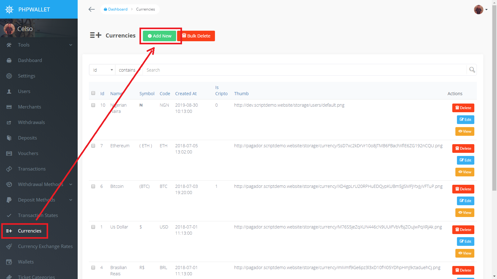
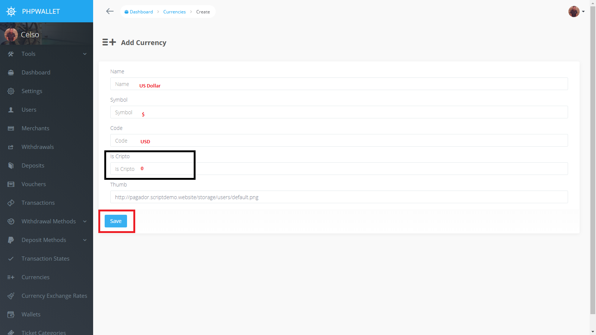

Setting up  currencies
==============================

Before setting up anything in phpWallet, first we need to have currencies to work with.

* Go to currencies menu and click the Add New Button

* Fill the form, the `Is Crypto` field values are `1` for cryptocurencies and `0` for fiat.

