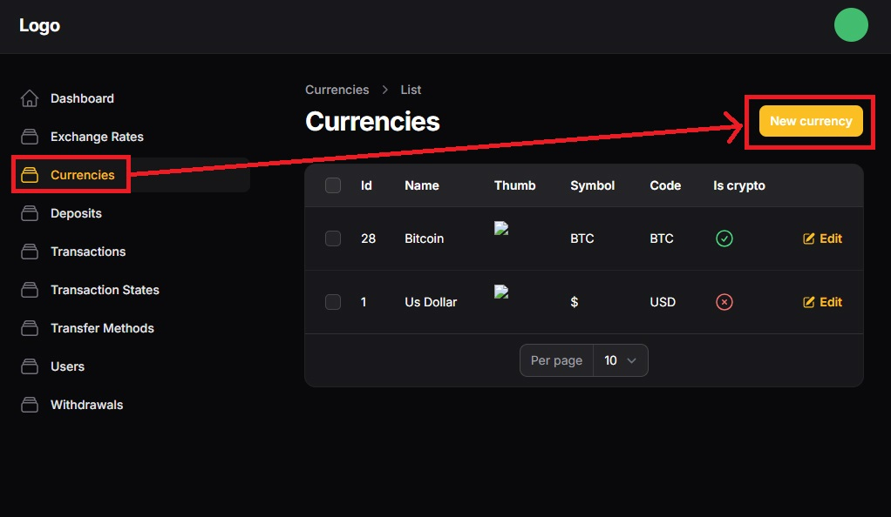
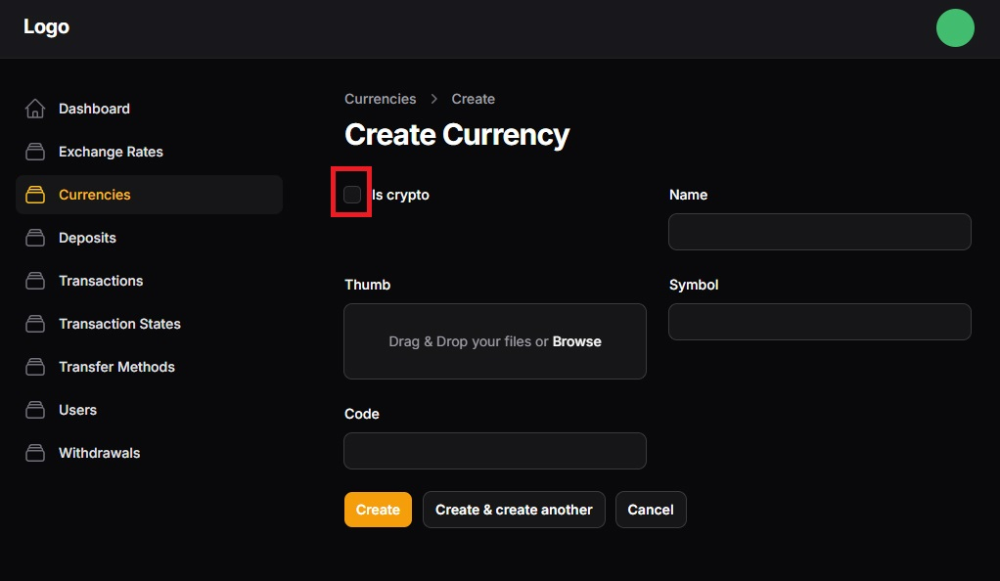

# Setting up currencies

Before setting up anything in filamentWallet, first you are going to have currencies already registered to work with. ( if not, it is the first system entity to be registered)

- Go to currencies menu and click the Add New Button

- Fill the form, the `Is Crypto` field values are `1` for cryptocurencies and `0` for fiat.

