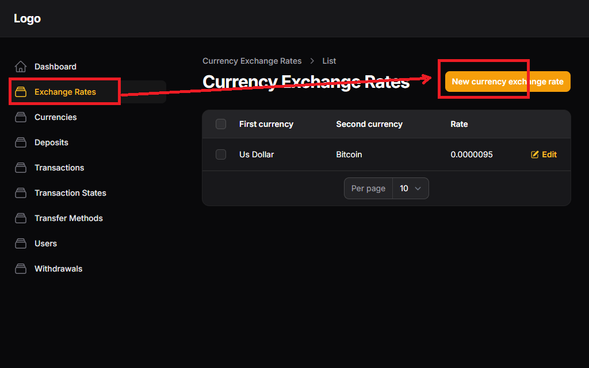
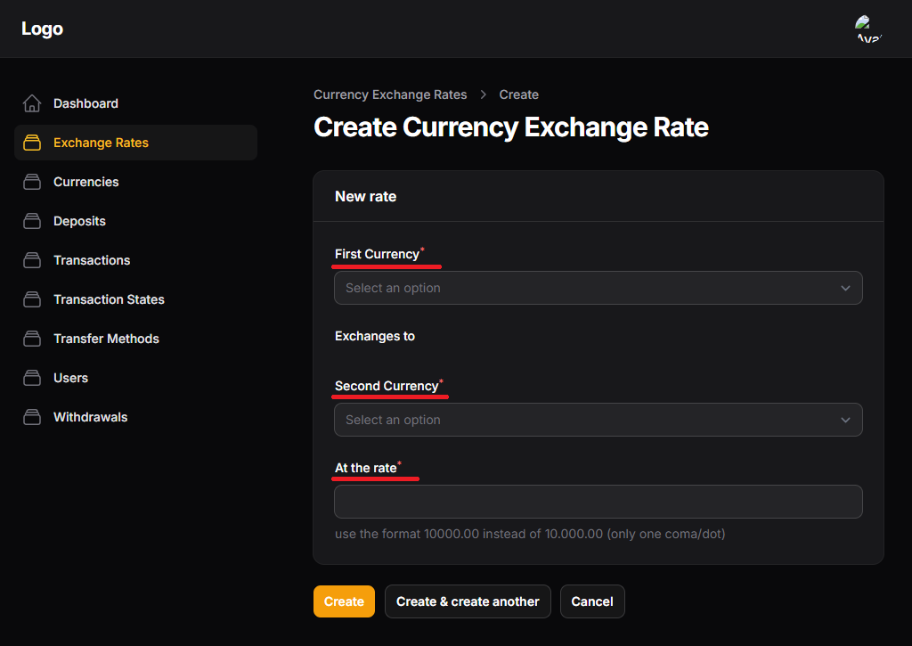

# Adding new rates

Let's assume that you want to allow your website users to convert the amount in their USD wallet to Bitcoin. First, you as the website administrator will need to setup a new conversion rate from USD to Bitcoin.

- first click the Exchange Rate link in the left menu and then select new currency exchange rate.

Now, let's assume that the financial markets are setting that to get 0.0000095 Bitcoins it is needed 1 USD in exchange.

that means 1 USD exchanges to 0.0000095 Bitcoins

First Currency = USD

Exchanges to

Second Currency = Bitcoin

at the rate = 0.0000095
