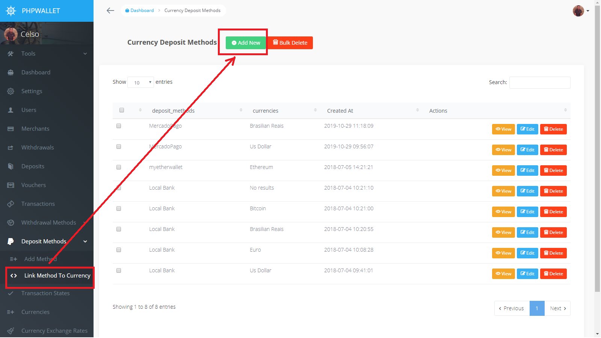

Deposit Methods
===============

For this guide, we will be registering a method Named Banco MOC that accepts USD deposits.

## __First step: Register the deposit method__

* Go to Deposit Methods menu, select the Add Method submenu and click the Add New Button

* Whrite the Deposit Method information like ( Banc Account Number / Crypto Wallet address / ... ), and click Save

  

## __Second step: Link the method to a currency__

Now that we have registered the Deposit Method, we need to define in which currency the deposits are going to be made for this method, and we do this by linking a currency to a deposit method.                         

* Go to Deposit Methods menu, select the Link Method To Currency submenu and click the Add New Button

  

* Select the newly created method and the curreny for that method then click save.

  