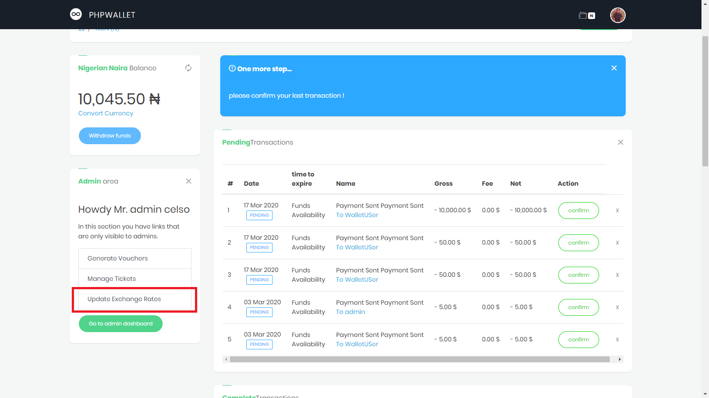

<!--

  <iframe width="1280" height="720" src="https://www.youtube.com/embed/vZNyjuNLhIk" frameborder="0" allowfullscreen></iframe>

-->

Withdrawal Methods
==================

One way to profit with phpWallet is to allow users to convert the available currencies and then withdraw. E.g: ( BTC to USD ) or ( EUR to USD ).

So, to set/update conversion rates for a given currencie, the first step is to make that currencie default. To achieve this do the following : 

* Select the current wallet, this will automatically set the wallet currency as the default currency.

 

* Select the update rates menu, this will only be available for admin users.

* Update the rates for each available currencie, this form is also available for admin users.

