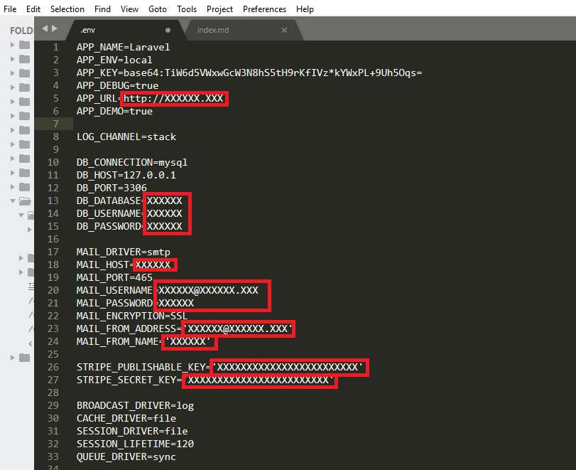
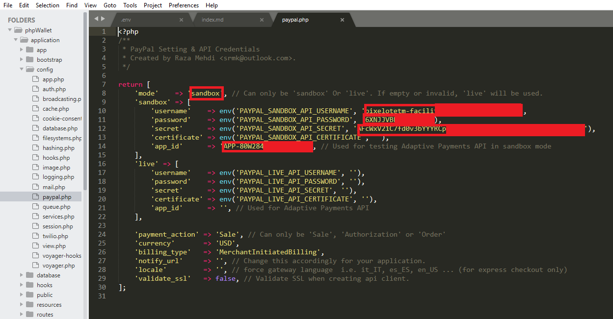
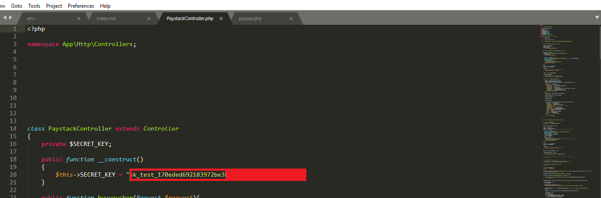

Welcome to phpWallet documentation
=================

The first step in the installation process is to make sure that your php version is greater than 7.1 and you have a mysql database already created with the .sql file you've downloaded from Codecanyon is already imported into it.

## __Step 1__

* Upload The phpWallet zip file to your server's ` public_html/ ` folder.
* Create a database and write-down the database name, user , and password for [step 2](#step-2)
* Import the .sql to your recently created databse. Use your cpanel  phpMyadmin
* Create an email account and write-down the email's ` smtp ` info for [step 2](#step-2)

## __Step 2__

* In your server go to ` .. /public_html/application/.env ` and edit the .env file

## __Step 3__

* Copy the symbolic link folder ` storage ` from ` .. /public_html/application/public/ `  to ` .. /public_html/ `

## __Configuring PayPal__
### Step 1

* go to ` .. /public_html/application/config/paypal.php ` and edit the paypal.php file

### Step 2

* go to ` www.yourwebsite.com/admin ` and login with an admin account, then activate the PayPal gateway in settings menu

## __Configuring Paystack__
### Step 1

* go to ` .. /public_html/application/http/controllers/PaystackController.php ` and edit the PaystackController.php file

### Step 2 
* Activate the Paystack gateway in settings menu. ( process described [here](#step-2_1)  )

## __Configuring Stripe__
### Step 1

* Set ` STRIPE_PUBLISHABLE_KEY ` and ` STRIPE_SECRET_KEY `  ( line 26 and 27 ) in the .env file described in [step 2](#step-2) 

### Step 2 
* Activate the Stripe gateway in settings menu. ( process described [here](#step-2_1)  )