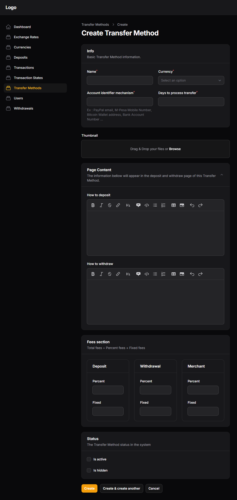

# Transfer Methods

The pilar of this filamentWallet.

## **What is a Transfer Method**

Well, now that your filamentWallet already have a set of your choosen currencies to work with, the next building block for this contruction is registering some transfer methods.

but, what is a transfer method ?

first let us understand how this wallet works, this filamentWallet is fully managed by the site administrator who frequelnty is also the site owner, meaning ( no tirth party rest API's integrated in the filamentWallet )
the administrator has to check with his own eyes, all the deposits and withdraw requests made by the site users and process them by the good, well known, and old mouse over and button click.

so, to receive deposits, the admin must own ( a bank account, paypal, zele or other way he plans to add amount in his site user's accounts ) first, and that will be the deposit and also withdraw method from the currency for the ( paypal, bank account, zele, stripe ) ...

in other words, a transfer method is just the information about the account from where the users will be transfering amount to, for getting their wallets amount increased by the admin, and also the account from where they will be receiving withdrawals from the admin.

for better management of money, we decided that a currency registerd in this filamentWallet will only accept one teransfer method.
so, if the filamentWallet has 7 currencies registered, it will need 7 transfer methods also registered to have to have it functioning properly.

The .sql file that goes with the code download zip file has already some examples registered.

it is easy to follow the example from the ones that already are in the demo filamentWallet, they can also be discarted for the convenience of the site's owner linkings.

## **The Transfer Method Form**

