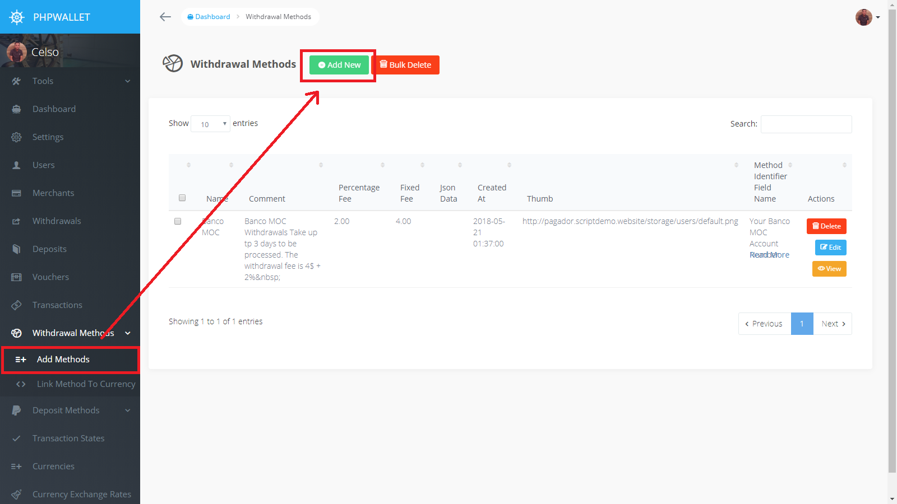

Withdrawal Methods
==================

For this guide, we will be registering a method Named Banco MOC for allowing clients to  withdraw their USD wallets.

## __First step: Register the whithdrawal method__

* Go to Withdrawal Methods menu, select the Add Method submenu and click the Add New Button

* Whrite the Withdrawal Method information and click Save
* A Note: the `Method Identifier Field Name` is the label for the method unique identifier for the client. 

Eg: if we were doing a bitcoin withdrawal method to withdraw bitcoins, the `Method Identifier Field Name` filed value would be " Your Bitcoin Address "

if we were doing a mobile money withdrawal method. the `Method Identifier Field Name` field value would be " Your Phone Number "

  

## __Second step: Link the method to a currency__

Now that we have registered the Withdrawal Method, we need to define in which currency the withdrawals are going to be made for this method, and we do this by linking a currency to a withdrawal method.                         

* Go to Withdrawal Methods menu, select the Link Method To Currency submenu and click the Add New Button

  

* Select the newly created method and the curreny for that method then click save.

  